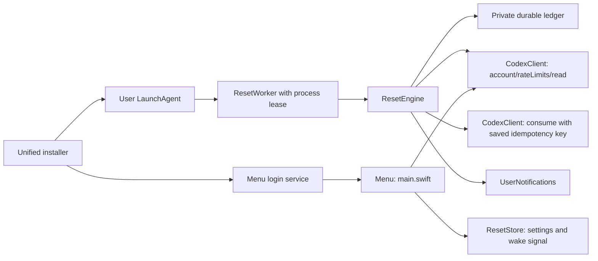

# Architecture

`UsageModels.swift` parses sanitized usage and internal reset metadata. Internal credit IDs and recovery keys do not enter the printable payload. `StatusIcon.swift` preserves the existing icon. `CodexClient.swift` owns bounded stdio JSON-RPC and suppresses raw server stderr.

`ResetEngine.swift` contains the clock, freshness, eligibility, notification milestones and durable recovery policy. A core 300-minute or 10080-minute window with at least 90% used allows a conditional attempt in the final 1200 seconds. A second read verifies the same unexpired credit. Settings/ownership are rechecked immediately before consuming. Intent is durably saved first; an uncertain result retries the same key after 180 seconds. While any pending intent exists, all other credits are excluded from new consumption, including during retry delays and after restart. Only an authoritative same-key response resolves that intent; absence from a fresh read does not imply success. Existing reminders remain independent of this hold. Known successful outcomes are terminal. Missing/expired uncertain credits hold further use for review. A five-minute success cooldown limits stale-data effects.

`ResetRuntime.swift` provides the actual CLI service, macOS notifier and serial launchd worker loop. The worker requires both the selected service's `XPC_SERVICE_NAME` and exact executable path. `ResetStore.active()` also validates the selected LaunchAgent points to that executable with `--reset-worker`. A nonblocking exclusive lease prevents a second consumer. The worker checks minute deadlines and wake/settings signals; there is no model process or independent cloud scheduler.

`ResetAutomation.swift` is a read-only compatibility adapter for the prior watcher. It reads only policy, state and a bounded log tail. It is retained for pre-handoff installations and the offline preview. It neither imports Python code nor executes the old watcher.

The menu alone never consumes. The CLI consumption result remains authoritative: `reset`, `alreadyRedeemed`, `nothingToReset` and `noCredit` are distinct. An empty credit list is not proof of redemption. Notification status and redemption status are independent.

`Scripts/install.sh` and `uninstall.sh` call `installation.py` for one lifecycle. New installations create both user services, with auto-use off and reminders on. Updates reuse the registered worker's label and executable location and keep existing settings. A single recognized legacy Python service is stopped before its final ledger is imported and its label repointed. Ambiguous services and uncertain legacy outcomes block changes.

An installation lock serializes lifecycle operations. After both processes exit, worker/settings locks protect the final records while files are replaced. A durable journal and private bundle/configuration backups recover interrupted transactions. The worker and menu first start with inactive ownership, so startup verification cannot redeem or notify. Ownership is activated only after the transaction commits; interrupted activation completes forward and never rolls an activated worker back onto an older recovery record. Removal does not activate a paused transaction. `state.json` is never restored from a stale snapshot, and uninstall retains it with settings and backups.

The older `reset-worker.py` remains for recovery of backups created by that helper. New installations and ordinary upgrades use the unified installer. No Swift consumption or notification policy is changed by this installation work.

`MenuPresentation.swift` provides compact, read-only count/expiry presentation and conditional warnings. Normal worker status/history/timing explanations stay in the Details submenu. It changes no consume, notifier or worker policy.
